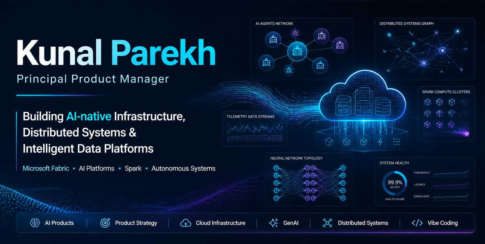

---

# 🚀 About Me

I'm a **Principal Product Manager at Microsoft** focused on AI-enabled infrastructure, distributed systems, cloud-scale analytics platforms, and developer productivity.

I enjoy turning complex infrastructure into intuitive products that help engineering teams build, troubleshoot, and scale faster.

## 🔭 Current Focus

- 🤖 AI-native Infrastructure
- ⚡ Microsoft Fabric & Spark
- 🧠 Agentic AI & MCP
- 📊 Big Data Intelligence Hub
- 🚀 Vibe Coding
- 🔍 Intelligent Product Discovery

---

# 📈 Microsoft Impact

| Impact | Outcome |
|---------|---------|
| 🌍 Large-scale Analytics Platform | Led migration of one of Microsoft's largest Cosmos analytics platforms |
| ⚡ AI Productivity | Reduced operational incidents by **15%** |
| 🔎 Incident Investigation | Reduced triage time by **30%** |
| 📚 Thought Leadership | Published engineering work on Microsoft Fabric resource provisioning |

---

# 🌟 Featured AI Products

| Product | Description |
|---------|-------------|
| 📰 Big Data Intelligence Hub | AI-powered insights for modern data platforms |
| ✈️ FlyMate AI | Intelligent travel planning assistant |
| 📈 InvestIntel | AI-powered investment planning |
| 🤖 MCP Product Assistant | AI assistant for engineering productivity |
| ⚡ Forecasting Service | Proactive Spark resource provisioning |

---

# 🎤 Talks & Publications

### Talks

- AI Product Management
- Microsoft Fabric & Spark
- Building AI Products
- Vibe Coding Workshop

### Publications

- Microsoft Fabric Engineering Blog
- VLDB Research
- AI Product Management Workshop

---

# 🛠 Technology Stack

### AI
`OpenAI` • `Azure AI` • `GitHub Copilot` • `Claude` • `Gemini` • `MCP`

### Data
`Microsoft Fabric` • `Spark` • `Synapse` • `Cosmos` • `Databricks` • `Snowflake`

### Cloud
`Azure` • `Kubernetes` • `Containers`

### Product
`Power BI` • `Kusto` • `Figma` • `Prompt Engineering`

---

# 📊 GitHub Stats

> Replace `parkk27` with your username if it changes.

---

# 🔬 Currently Exploring

- Autonomous Search
- Intent-based Computing
- Multi-Agent Systems
- AI Infrastructure
- Distributed Reasoning
- AI Platform Engineering

---

# 🤝 Connect

- 🌐 Portfolio: https://kunalparekh-portfolio.netlify.app/
- 💼 LinkedIn: https://www.linkedin.com/in/kp27/
- 💻 GitHub: https://github.com/parkk27

---

> *"Building intelligent infrastructure that enables the next generation of AI products."*
